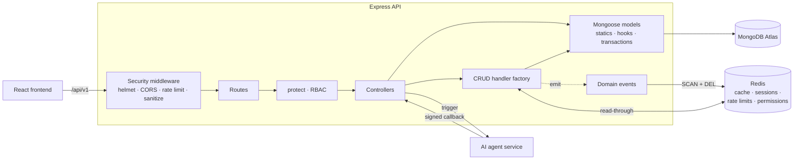

# EduCourse API

REST backend for **[EduCourse](https://educourse.praisealimi.com)**, an e-learning platform where building professionals take safety courses, track progress, earn certificates, and where instructors publish courses and earn from sales.

**Stack:** Node.js 22 · TypeScript (strict) · Express · MongoDB Atlas (Mongoose) · Redis · Vitest · Docker · GitHub Actions · Sentry · Render

---

## Architecture



- **Controllers stay thin.** Standard CRUD goes through one generic handler factory that handles caching, filtering, sorting, field projection, pagination and event emission for 20+ resources.
- **Cross-document logic lives in model statics.** These cover the transactional enrollment, rating averages and student counts.
- **Cache invalidation is event-driven.** Writes emit domain events, and per-resource listeners clear matching Redis keys with non-blocking `SCAN`, never `KEYS`.

## Engineering highlights

### Refresh-token rotation with reuse detection
Access JWTs are short-lived (15 minutes by default). Refresh tokens live for 7 days, sit in an httpOnly cookie scoped to `/api/v1/users`, and are stored **only as SHA-256 hashes**.
- Every refresh **rotates** the token.
- Presenting an already-rotated token is treated as theft, and **every session for that user is revoked**.
- Rotation is a single atomic `findOneAndUpdate`, so two concurrent refreshes with the same token can't both succeed. A test reproduces exactly that race.

### Atomic enrollment
Enrolling a student writes four documents: the enrollment, the progress record, the instructor's earning (with a 30% platform-fee split) and a notification. They run in **one MongoDB transaction**, so a failure part-way leaves nothing behind. The denormalised `studentsQuantity` counter is updated inside the same transaction. Cache events fire only after commit.

### Authorization
- Three roles (`user` < `instructor` < `admin`) with a resource × action permission matrix.
- Owner-or-role checks, with permission lookups cached in Redis.
- Users can only enroll themselves; admins can enroll anyone.

### AI agent integration
The API triggers a separate agent service for eight jobs, among them course discovery, quiz generation, learning paths, review sentiment and auto-tagging. Results come back through API-key-authenticated webhooks, checked with a **constant-time comparison**. Every run is persisted for tracking, and outbound errors are scrubbed of secrets before logging.

### Security
helmet, a CORS allowlist, Redis-backed distributed rate limiting (5 req / 15 min on auth), NoSQL-injection and XSS sanitisation, sanitize-html for rich text, a 10 kb body limit and bcrypt password hashing.

## Testing

```bash
npm test
```

- **Unit:** fee-split money maths, constant-time key comparison and the callback guard, cache-key determinism, error types.
- **Integration:** the real Express app runs under Supertest against an **in-memory MongoDB replica set** (needed for transactions) and an in-memory Redis stand-in. Covered: login, token rotation, reuse detection, the concurrent-refresh race, expiry and logout; enrollment atomicity, rollback on mid-transaction failure, duplicate/404 handling, and the enroll-yourself rule.

CI runs typecheck, lint, tests and build on every PR, and every step is blocking.

## Running locally

```bash
cp config.env.example config.env   # fill in MongoDB, Redis, JWT and session secrets
npm install
npm run dev                         # tsx, http://localhost:3050
```

Or with Docker. The bundled MongoDB runs as a single-node replica set so transactions work:

```bash
docker compose up --build
```

| Script | Purpose |
|---|---|
| `npm run dev` / `dev:watch` | Run from source |
| `npm test` | Unit + integration tests |
| `npm run typecheck` | `tsc --noEmit` (strict) |
| `npm run lint` | ESLint (TypeScript) |
| `npm run build` / `start` | Compile to `dist/` and run |

## API

All endpoints are under `/api/v1/`. The full reference is in [docs/API.md](docs/API.md).

| Area | Base path |
|---|---|
| Auth & users | `/users` |
| Courses, modules, lessons | `/courses`, `/modules`, `/lessons` |
| Enrollment & progress | `/enrollments`, `/completed-courses`, `/certificates` |
| Instructor earnings | `/earnings` |
| Reviews, wishlist, notifications | `/reviews`, `/wishlist`, `/notifications` |
| Blog | `/blogs`, `/comments`, `/tags`, `/category` |
| Search & AI | `/search`, `/ai` |
